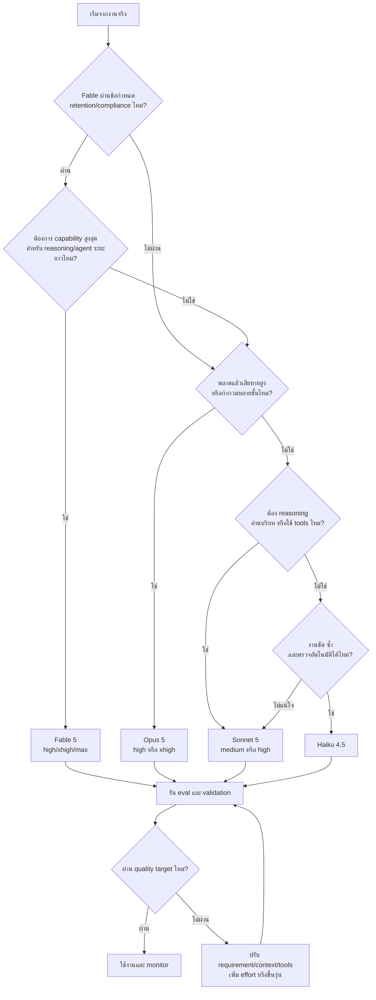
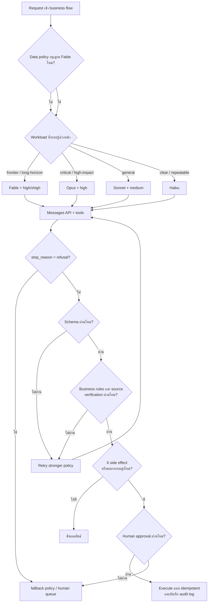
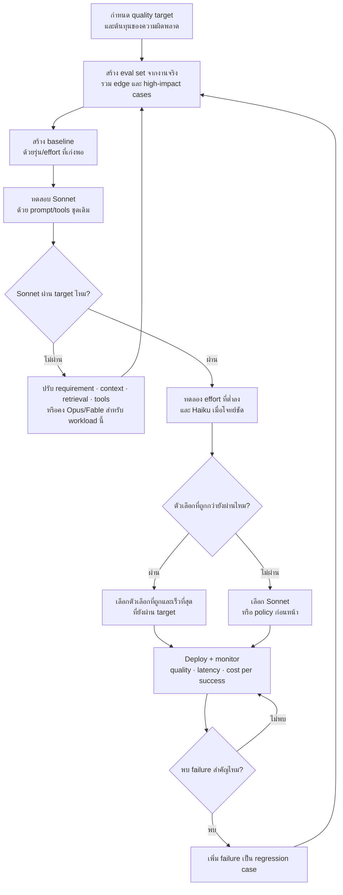

# เลือกและใช้ Claude ให้เต็มประสิทธิภาพ

> **หลักเดียวที่ต้องจำ:** เลือกด้วยความเสี่ยง ความกำกวม และหลักฐาน ไม่ใช่ชื่อรุ่น
>
> **งานโต้ตอบ:** เริ่ม Sonnet เมื่องานทั่วไปและขอบเขตชัด, ขึ้น Opus เมื่อต้องใช้ judgment สูง, ใช้ Fable เมื่อต้องการขีดความสามารถสูงสุดกับงาน reasoning/agent ระยะยาว, และทดลอง Haiku เมื่องานชัด ซ้ำ และตรวจอัตโนมัติได้
>
> **ระบบ production:** สร้าง quality baseline ด้วยรุ่นที่เก่งพอ → วัดด้วยงานจริง → ลดรุ่นหรือ effort เมื่อผลยังผ่านเกณฑ์

คู่มือนี้อธิบายการเลือก **Claude Fable 5 / Opus 5 / Sonnet 5 / Haiku 4.5** สำหรับ Claude, Claude Code และ Claude API โดยเน้นงานพัฒนา software และงานวิชาชีพที่ต้องแลกกันระหว่างคุณภาพ ความเร็ว และต้นทุน

แนวทางนี้ใช้โครงคิดเดียวกับ [how-to-use-gpt](https://github.com/zgame555/how-to-use-gpt) ในเรื่อง risk, eval, validation และ cost per successful task แต่ปรับรายละเอียดทั้งหมดให้ตรงกับระบบของ Anthropic ไม่สมมติว่าโมเดลหรือฟีเจอร์ของสองค่ายเทียบกันแบบหนึ่งต่อหนึ่ง

ข้อมูลรุ่นและราคาอัปเดตล่าสุด: **2 สิงหาคม 2026** — ชื่อรุ่น ราคา availability และ UI เปลี่ยนได้เสมอ โปรดตรวจ [Models overview](https://platform.claude.com/docs/en/about-claude/models/overview), [Pricing](https://platform.claude.com/docs/en/about-claude/pricing) และ [Claude Code model configuration](https://code.claude.com/docs/en/model-config) ก่อนนำตัวเลขไปใช้ตัดสินใจทางธุรกิจ

### ทางลัดสำหรับผู้อ่าน

| ถ้าต้องการ | เริ่มอ่านที่ |
|---|---|
| เลือกโมเดลให้จบเร็ว | [เลือกโมเดลภายใน 30 วินาที](#3-เลือกโมเดลภายใน-30-วินาที) |
| ตั้งค่า Claude Code หรือ API | [สลับโมเดลและ effort](#4-สลับโมเดลและ-effort-อย่างไร) |
| ออกแบบระบบ API ที่ route หลายรุ่น | [Production routing](#9-ออกแบบระบบ-routing-สำหรับ-api) และ [evals](#10-วัดคุณภาพด้วย-evals) |
| ประเมินและลดค่าใช้จ่าย | [คำนวณและลดต้นทุน](#11-คำนวณและลดต้นทุน) |
| ใช้ Claude Code กับ Git อย่างปลอดภัย | [Git checkpoint protocol](#git-checkpoint-protocol-สำหรับ-claude-code) |
| วาง guardrail สำหรับงานสำคัญ | [กฎสำหรับงานเสี่ยงสูง](#14-กฎสำหรับงานเสี่ยงสูง) |

---

## สารบัญ

1. [แยก Claude, Claude Code และ API ให้ออกก่อน](#1-แยก-claude-claude-code-และ-api-ให้ออกก่อน)
2. [รู้จัก Claude ทั้งสี่รุ่น](#2-รู้จัก-claude-ทั้งสี่รุ่น)
3. [เลือกโมเดลภายใน 30 วินาที](#3-เลือกโมเดลภายใน-30-วินาที)
4. [สลับโมเดลและ effort อย่างไร](#4-สลับโมเดลและ-effort-อย่างไร)
5. [คันโยกที่สำคัญกว่าการเปลี่ยนโมเดล](#5-คันโยกที่สำคัญกว่าการเปลี่ยนโมเดล)
6. [สูตรทำงานที่ใช้ได้กับทุกโปรเจกต์](#6-สูตรทำงานที่ใช้ได้กับทุกโปรเจกต์)
7. [เลือกตามสายงาน](#7-เลือกตามสายงาน)
8. [เคสจริง](#8-เคสจริง)
9. [ออกแบบระบบ routing สำหรับ API](#9-ออกแบบระบบ-routing-สำหรับ-api)
10. [วัดคุณภาพด้วย evals](#10-วัดคุณภาพด้วย-evals)
11. [คำนวณและลดต้นทุน](#11-คำนวณและลดต้นทุน)
12. [สัญญาณว่าเลือกโมเดลหรือวิธีทำงานผิด](#12-สัญญาณว่าเลือกโมเดลหรือวิธีทำงานผิด)
13. [เรื่องที่เข้าใจผิดบ่อย](#13-เรื่องที่เข้าใจผิดบ่อย)
14. [กฎสำหรับงานเสี่ยงสูง](#14-กฎสำหรับงานเสี่ยงสูง)
15. [มุมมองแบบ senior](#15-มุมมองแบบ-senior)
16. [Cheat sheet](#16-cheat-sheet)
17. [แหล่งอ้างอิงทางการ](#17-แหล่งอ้างอิงทางการ)

---

## 1. แยก Claude, Claude Code และ API ให้ออกก่อน

คำว่า “ใช้ Claude” อาจหมายถึงผลิตภัณฑ์คนละแบบ ซึ่งมีวิธีเลือกโมเดล การคิดค่าใช้จ่าย และขอบเขตควบคุมต่างกัน

| พื้นผิว | เหมาะกับ | เลือกโมเดลอย่างไร | ค่าใช้จ่ายหลัก |
|---|---|---|---|
| **Claude web / desktop / mobile** | สนทนา วิเคราะห์ เขียน ค้นคว้า และทำงานกับไฟล์ | ตัวเลือกใน UI ตาม plan/workspace | subscription, usage limit และ usage credits ถ้าเปิดใช้ |
| **Claude Code** | อ่าน แก้ ทดสอบ และ review code ใน repo | `/model`, `--model`, aliases และ `settings.json` | รวมในบาง plan หรือคิดตาม API/usage credits ตามวิธี login |
| **Claude API / cloud platforms** | ฝังโมเดลใน product, backend, agent และ automation | ระบุ model ID และพารามิเตอร์ใน request | tokens, caching, tools, geography และ service mode |

สิ่งสำคัญ:

- Claude subscription และ Claude API/Console เป็นคนละผลิตภัณฑ์ การมี Pro/Max/Team/Enterprise **ไม่ได้แปลว่ามี API credit**
- โมเดลที่มีให้เลือกขึ้นกับ plan, workspace policy, region, provider และ client version
- ชื่อ alias ใน Claude Code เช่น `sonnet`, `opus`, `haiku` อาจชี้ไปยังรุ่นแนะนำที่เปลี่ยนได้ตาม provider; ถ้าต้องการ behavior คงที่ให้ใช้ model ID เต็มและมี regression eval
- เปรียบเทียบราคา API กับโควตา subscription ตรง ๆ ไม่ได้ แต่ตรรกะเรื่องคุณภาพ ความเร็ว และต้นทุนยังใช้ร่วมกันได้

---

## 2. รู้จัก Claude ทั้งสี่รุ่น

| โมเดล | Claude API ID | บทบาทตามเอกสาร Anthropic | เลือกเมื่อ |
|---|---|---|---|
| **Claude Fable 5** | `claude-fable-5` | ขีดความสามารถสูงสุดที่เปิดใช้ทั่วไป | reasoning ที่ยากที่สุด งาน agent ระยะยาว และงานที่คุณภาพสำคัญกว่าราคา/latency |
| **Claude Opus 5** | `claude-opus-5` | complex agentic coding และ enterprise work | architecture, debugging ยาก, งานกำกวม และการตัดสินใจหลายชั้น |
| **Claude Sonnet 5** | `claude-sonnet-5` | สมดุลความเร็วกับ intelligence ดีที่สุด | งานประจำวัน งาน coding ทั่วไป tool use และงาน production ที่ผ่าน eval แล้ว |
| **Claude Haiku 4.5** | `claude-haiku-4-5-20251001` หรือ alias `claude-haiku-4-5` | เร็วและประหยัดที่สุด | classification, extraction, transform, boilerplate และงานซ้ำที่ขอบเขตชัด |

### ความสามารถและขนาดบริบท

| โมเดล | Context window | Max output | Adaptive thinking | Manual extended thinking |
|---|---:|---:|---|---|
| Fable 5 | 1M | 128K | รองรับและเปิดตลอด | ไม่รองรับ |
| Opus 5 | 1M | 128K | รองรับ | ไม่รองรับ |
| Sonnet 5 | 1M | 128K | รองรับ | ไม่รองรับ |
| Haiku 4.5 | 200K | 64K | ไม่รองรับ | รองรับ |

`Context window` คือเพดานรวมของ input และ output ที่โมเดลประมวลผลใน request ไม่ใช่เป้าหมายว่าควรส่งข้อมูลให้เต็ม การส่ง repo หรือประวัติทั้งหมดอาจเพิ่ม noise, latency และต้นทุนโดยไม่เพิ่มคุณภาพ

### ราคา Claude API แบบ Standard — global

ราคาต่อ 1 ล้าน tokens (USD):

| โมเดล | Input | 5m cache write | 1h cache write | Cache read | Output |
|---|---:|---:|---:|---:|---:|
| Fable 5 | $10 | $12.50 | $20 | $1.00 | $50 |
| Opus 5 | $5 | $6.25 | $10 | $0.50 | $25 |
| Sonnet 5 | $3 | $3.75 | $6 | $0.30 | $15 |
| Haiku 4.5 | $1 | $1.25 | $2 | $0.10 | $5 |

> **ราคาชั่วคราว:** Sonnet 5 ราคา $2 input / $10 output ต่อ MTok ถึง **31 สิงหาคม 2026** และกลับเป็น $3 / $15 ตั้งแต่ 1 กันยายน 2026

ข้อสังเกต:

- output แพงกว่า input 5 เท่าในทั้งสี่รุ่น จึงควรตัดคำตอบยาวที่ไม่สร้างคุณค่าก่อนลดรุ่น
- Batch API ลดค่า input/output 50% สำหรับงานที่ไม่ต้องตอบทันที
- cache read คิด 10% ของ input ปกติ เหมาะกับ system prompt, tools หรือเอกสารนำหน้าที่ใช้ซ้ำ
- `inference_geo: "us"` บนรุ่น 4.6 ขึ้นไปมีตัวคูณราคา 1.1 เท่า; global เป็นค่าเริ่มต้น
- ราคา partner cloud และ feature บางชนิดอาจต่างจากตารางนี้

### จำง่ายแบบไม่ทำให้เข้าใจผิด

```text
Fable = ความสามารถสูงสุด สำหรับ reasoning และ long-horizon agent ที่ยากที่สุด
Opus  = ตัวหลักสำหรับ complex coding, architecture และ judgment สูง
Sonnet = สมดุลคุณภาพ/ความเร็ว/ราคา สำหรับงานทั่วไป
Haiku = งานชัด ซ้ำ เร็ว และตรวจผลได้
```

**Fable ไม่ใช่โมเดล “สายเขียนคำ”** และไม่อยู่คนละแกนกับโมเดลอื่น งาน copy ทั่วไปใช้ Sonnet ได้ ส่วน copy ที่ต้องใช้ judgment สูงอาจใช้ Opus/Fable แต่เหตุผลคือ capability ไม่ใช่ specialization ด้านภาษา

นี่ไม่ใช่ pipeline บังคับว่า “Fable คิด → Opus ออกแบบ → Sonnet เขียน → Haiku เก็บงาน” ทุกครั้ง งานเดียวอาจใช้ Sonnet จบได้ หรือใช้ Opus/Fable ทั้งหมดเมื่อความเสี่ยงสูง การสลับรุ่นคุ้มก็ต่อเมื่อค่าประสานงานและ cache miss ต่ำกว่าประโยชน์ที่ได้

### ข้อควรรู้เฉพาะ Fable 5

- Fable เป็นโมเดลที่เก่งที่สุดของ Anthropic สำหรับงาน reasoning และ agent ระยะยาว ไม่ใช่รุ่นสำหรับ copywriting โดยเฉพาะ
- adaptive thinking เปิดตลอด ใช้ `output_config.effort` คุมความลึก
- API อาจตอบ `stop_reason: "refusal"` ด้วย HTTP 200 ต้องจัดการเป็นสถานะทางธุรกิจ ไม่ใช่รอจับเฉพาะ exception
- Fable มีข้อกำหนด retention 30 วันและไม่รองรับ zero data retention จึงไม่เหมาะกับทุก workload ที่อ่อนไหว แม้ capability สูงสุด

---

## 3. เลือกโมเดลภายใน 30 วินาที

ถาม 6 ข้อนี้ตามลำดับ:

1. **มีข้อกำหนด data retention/ZDR ที่ Fable ไม่ผ่านไหม?** → ตัด Fable ออกจากตัวเลือกก่อน
2. **เป็นงาน reasoning/agent ที่ยากที่สุดและยาวมาก โดยคุณภาพสำคัญกว่าราคา/latency ไหม?** → เริ่ม Fable
3. **พลาดแล้วเสียหายมาก หรือโจทย์กำกวมและต้องตัดสินใจหลายชั้นไหม?** → เริ่ม Opus
4. **เป็นงานทั่วไปที่ต้องอ่านบริบท ใช้ tools และตรวจผลไหม?** → เริ่ม Sonnet
5. **คำตอบที่ดีนิยามได้ชัด งานซ้ำ และตรวจอัตโนมัติได้ไหม?** → ทดลอง Haiku
6. **มี eval ยืนยันว่าตัวเลือกนั้นผ่านเกณฑ์หรือยัง?** ถ้ายัง → อย่าลดรุ่นเพราะความรู้สึก

### Flow เลือกโมเดล



### Decision table

| ลักษณะงาน | เริ่มที่ | Effort เริ่มต้น | เหตุผล |
|---|---|---|---|
| long-horizon agent ที่ยากที่สุด | Fable | high/xhigh | ต้องการ capability สูงสุดและยอมรับต้นทุน/retention ได้ |
| กำกวม ซับซ้อน มูลค่าสูง | Opus | high | ต้องใช้ judgment และวางแผน |
| งาน software ทั่วไป | Sonnet | medium/high | สมดุลคุณภาพกับความเร็ว |
| extraction/classification ที่มี schema ชัด | Haiku | manual thinking off หรือต่ำ | volume สูงและตรวจผลได้ |
| debug ที่ยังไม่รู้ root cause | Opus | high/xhigh | ต้องสร้างและหักล้างสมมติฐาน |
| refactor ตาม pattern ที่พิสูจน์แล้ว | Haiku/Sonnet | low/medium | ขอบเขตชัด แต่ยังต้องตรวจ build/test |
| architecture/security review | Opus/Fable | high/xhigh | ความผิดพลาดกระทบกว้าง |
| copy ทั่วไป | Sonnet | low/medium | ไม่มีโมเดล “สายคำ” แยกในตระกูลนี้ |
| copy สำคัญต่อแบรนด์หรือ conversion | Opus | medium/high | ต้องใช้ nuance และ judgment |

ตารางนี้คือ **ค่าเริ่มต้น** ไม่ใช่ผลรับรอง รุ่นใหญ่กว่าก็พลาดได้ และรุ่นเล็กอาจชนะใน workload เฉพาะทางที่ prompt, tools และ validation ดีกว่า

---

## 4. สลับโมเดลและ effort อย่างไร

### 4.1 Claude web / desktop / mobile

เลือกโมเดลและโหมดจาก UI ตาม plan และ workspace ที่ใช้ ชื่อใน UI, availability และ usage limit เปลี่ยนได้ จึงไม่ควรเขียน production policy โดยอิงว่าผู้ใช้ “เห็นปุ่มชื่ออะไร” บน Claude app

ผลจาก Claude app เหมาะกับการทดลองและสร้างตัวอย่าง แต่ไม่ใช่ benchmark ของ API โดยอัตโนมัติ เพราะ system prompt, tools, memory, connectors และ context management ต่างกัน

### 4.2 Claude Code — ระดับ session

เปิด session ด้วย alias หรือ model ID:

```bash
claude --model sonnet
claude --model opus
claude --model fable
claude --model claude-sonnet-5
```

เปลี่ยนระหว่าง session:

```text
/model
/effort
```

หรือกำหนด effort ตอนเปิด:

```bash
claude --model claude-opus-5 --effort high
```

aliases `fable`, `opus`, `sonnet` และ `haiku` สะดวกสำหรับงานโต้ตอบ แต่เปลี่ยนปลายทางได้ตาม provider ส่วน `best` ใช้ Fable เมื่อองค์กรเข้าถึงได้และ fallback เป็น Opus เมื่อเข้าไม่ได้ หาก workflow ต้อง reproduce ผลเดิมให้ pin model ID เต็มและบันทึก prompt/tool version คู่กัน

### 4.3 Claude Code — ค่าเริ่มต้นใน settings

ตั้งใน `settings.json` ระดับ user, project หรือ managed policy ตามขอบเขตที่ต้องการ:

```json
{
  "model": "claude-sonnet-5",
  "effortLevel": "medium"
}
```

บน Claude Code รุ่นปัจจุบัน การเลือกด้วย `/model` แล้วกด `Enter` จะบันทึกเป็นค่าเริ่มต้นของ user ด้วย; กด `s` ใน picker เมื่อต้องการเปลี่ยนเฉพาะ session หรือใช้ `--model` ตอนเปิด session ใช้ `availableModels` ใน managed settings เมื่อต้องควบคุม allowlist ของทีม

Claude Code ยังมี alias `opusplan` ซึ่งใช้ Opus ตอนวางแผนและ Sonnet ตอนลงมือ เหมาะเมื่อ phase boundary ชัด แต่การสลับโมเดลทำให้ prompt cache ของเทิร์นถัดไปเริ่มใหม่ จึงไม่ควรสลับไปมาถี่ ๆ

### 4.4 Claude Code custom subagent

สร้างไฟล์ `.claude/agents/test-writer.md`:

```markdown
---
name: test-writer
description: เขียน unit tests ตาม behavior และ pattern ที่มีอยู่ โดยไม่แก้ production code
model: haiku
effort: low
tools: Read, Grep, Glob, Bash, Write, Edit
---

อ่าน test ที่มีอยู่ก่อนเสมอ
เขียนเฉพาะ test ตาม behavior ที่ parent agent ระบุ
ห้ามแก้ production code
รัน test ที่เกี่ยวข้องและรายงาน failure ตามจริง
```

ค่า `model` ใช้ `fable`, `opus`, `sonnet`, `haiku`, `inherit` หรือ model ID เต็มได้ ค่า default คือ `inherit` หากไม่ระบุ และ availability ยังขึ้นกับ client version, provider และ policy ขององค์กร

ใช้ subagents เมื่อ:

- มีงานอิสระอย่างน้อย 2–3 workstreams
- การอ่าน log/test แต่ละส่วนสร้าง context noise มาก
- ไฟล์ที่แก้ไม่ชนกัน หรือ agent ย่อยทำแบบ read-only
- มี owner รวมผลและเกณฑ์เสร็จที่ชัด

อย่าใช้เพียงเพราะ “หลาย agent น่าจะเก่งกว่า” ทุก agent ใช้ tokens และมี coordination overhead งานที่แตะไฟล์กลางเดียวกันพร้อมกันมักช้ากว่า agent เดียว

### 4.5 Claude API — Messages API

Python:

```python
import anthropic

client = anthropic.Anthropic()

message = client.messages.create(
    model="claude-sonnet-5",
    max_tokens=16_000,
    thinking={"type": "adaptive"},
    output_config={"effort": "medium"},
    messages=[
        {
            "role": "user",
            "content": "Review this API contract and find correctness and security risks.",
        }
    ],
)

for block in message.content:
    if block.type == "text":
        print(block.text)
```

บน Opus 5 และ Sonnet 5 adaptive thinking เปิดโดย default อยู่แล้ว การระบุ `thinking` ชัดช่วยให้คนอ่าน config เข้าใจเจตนา ส่วน Fable บังคับให้เปิด adaptive thinking ตลอด

### 4.6 Effort ไม่ใช่ thinking mode

`thinking` คุมว่า Claude ใช้ thinking blocks หรือไม่ ส่วน `output_config.effort` คุมปริมาณงานที่โมเดลทุ่มให้กับคำตอบทั้งหมด รวมข้อความ tool calls และ thinking

| Effort | เหมาะกับ |
|---|---|
| `low` | งานตรงไปตรงมา latency-sensitive และ subagent งานย่อย |
| `medium` | งานทั่วไปที่ต้องสมดุลคุณภาพ/ความเร็ว |
| `high` | reasoning, coding และ agentic work ที่ซับซ้อน — ค่า default ของ API |
| `xhigh` | long-running coding/agent work ที่ต้องสำรวจหลายรอบ |
| `max` | quality-first สูงสุดโดยไม่จำกัดการใช้ tokens เชิงพฤติกรรม |

ระดับที่รองรับต่างกันตามรุ่น โดย Haiku 4.5 ใช้ manual extended thinking (`budget_tokens`) แทน adaptive thinking รุ่นใหม่ อย่าส่ง `thinking: {"type": "enabled"}` ให้ Fable/Opus 5/Sonnet 5 เพราะไม่รองรับ

`effort` เป็น behavioral signal ไม่ใช่ hard token budget และ `max_tokens` ยังเป็นเพดานรวม thinking + response text ถ้าตั้งต่ำเกินไปคำตอบอาจถูกตัดกลางคัน

---

## 5. คันโยกที่สำคัญกว่าการเปลี่ยนโมเดล

หลายครั้งปัญหาไม่ได้มาจากรุ่น แต่เกิดจาก requirement, context, tools หรือวิธีตรวจงาน

### 5.1 Prompt ที่ดี: บอก outcome และเส้นแบ่งอำนาจ

โครงที่ใช้ได้กับงาน coding และ agent:

```text
Outcome      ต้องการผลลัพธ์อะไร
Context      ข้อมูล ไฟล์ และ source of truth อยู่ไหน
Constraints  อะไรห้ามเปลี่ยน ต้องรองรับอะไร
Done         จะตรวจว่าเสร็จและถูกอย่างไร
Authority    ทำอะไรได้เอง อะไรต้องขออนุมัติ
```

ตัวอย่าง:

```text
แก้ race condition ตอน reserve stock โดยรักษา API เดิม
reproduce ด้วย test ก่อนแก้ และแก้เฉพาะ inventory module
ห้ามเปลี่ยน database schema
เสร็จเมื่อ concurrent test ผ่าน 100 รอบและ test suite เดิมไม่ regression
ห้าม deploy หรือแก้ข้อมูลจริง
```

สิ่งที่ไม่ช่วย:

- “ทำให้ดีขึ้น” โดยไม่มี metric
- สั่งขั้นตอนละเอียดทั้งที่ยังไม่รู้ root cause
- ให้หลายเป้าหมายที่ขัดกันโดยไม่บอก priority
- ขอให้ “ตรวจทุกอย่าง” โดยไม่มีขอบเขตหรือ threat model

### 5.2 Context 1M ไม่ได้แปลว่าควรยัดทุกอย่าง

Context ใหญ่ช่วยให้อ่านงานยาว แต่ยังมีปัญหา signal-to-noise, cost และ lost-in-the-middle

แนวปฏิบัติ:

- ส่งไฟล์ที่เกี่ยวข้องตาม call graph หรือ dependency ไม่ใช่ทั้ง repo โดยอัตโนมัติ
- ให้ Claude สำรวจด้วย search/tools แล้วเปิดไฟล์เป้าหมาย
- ใช้ `CLAUDE.md` สำหรับกฎที่ใช้ทุกงาน และย้าย workflow เฉพาะทางไปเป็น skills ที่โหลดเมื่อใช้
- เปลี่ยนเรื่องที่ไม่เกี่ยวกันให้ `/clear`
- ใช้ `/compact` พร้อมบอกสิ่งที่ต้องรักษาเมื่อ session ยาว
- อย่าเริ่ม refactor ใหญ่ปลาย session โดยไม่มี recap ของ requirement และสถานะ

โมเดลที่ดีใน context สะอาดมักชนะโมเดลที่ใหญ่กว่าใน context เต็มไปด้วย noise

### 5.3 Effort

เพิ่ม effort เมื่อ direction ถูกแต่ความลึกไม่พอ เช่น ข้าม edge case, หยุด tool loop เร็ว หรือวิเคราะห์ trade-off ตื้น

ลด effort เมื่อเป็น transform ตรง ๆ, มี template ชัด, latency สำคัญ หรือ eval บอกว่าคุณภาพไม่ลด

อย่าเปลี่ยน effort ทุกเทิร์นใน conversation ที่พึ่ง prompt caching เพราะการเปลี่ยนค่าทำให้ cache prefix บางส่วนใช้ต่อไม่ได้

### 5.4 เครื่องมือและหลักฐาน

Reasoning สูงไม่ได้สร้างข้อมูลปัจจุบันหรือข้อมูลในระบบที่โมเดลไม่เห็น

| ต้องการ | ให้ Claude ใช้ |
|---|---|
| ข้อมูลล่าสุด | web/search หรือ authoritative API |
| behavior ของโค้ด | test, compiler, runtime และ browser |
| schema/data จริง | read-only query, migration metadata หรือ sample ที่ลบข้อมูลอ่อนไหว |
| UI ที่ดี | reference, Figma, screenshot และ visual feedback loop |
| เอกสารเฉพาะองค์กร | retrieval/connector พร้อม source attribution |

แยก external content เป็น **untrusted data** เสมอ หน้าเว็บ issue log และเอกสารอาจมี prompt injection หรือคำสั่งที่ไม่ควรถูก execute

### 5.5 Prompt caching, Batch และ Fast mode

- **Prompt caching:** ใช้กับ prefix ที่ซ้ำ เช่น system prompt, tool definitions และเอกสารอ้างอิงขนาดใหญ่
- **Batch API:** เหมาะกับงาน offline ปริมาณมาก ลด input/output 50%
- **Fast mode:** ใช้โมเดลเดิมให้ output เร็วขึ้นด้วยราคาพรีเมียม เหมาะเมื่อ capability ถูกแล้วแต่ latency ยังสูง
- **Context editing/compaction:** ลด tool results และประวัติที่ไม่จำเป็นใน agent loop ยาว

เลือกเครื่องมือให้ตรง bottleneck: ถ้า latency มาจาก network tool calls การเปลี่ยนรุ่นอาจแทบไม่ช่วย ถ้าค่าใช้จ่ายมาจาก prompt ซ้ำ 100K tokens การ cache อาจคุ้มกว่าลดรุ่น

---

## 6. สูตรทำงานที่ใช้ได้กับทุกโปรเจกต์

### งานแบบ interactive / Claude Code

```text
1. Inspect   อ่าน repo, requirement และหลักฐานก่อน
2. Plan      ระบุ risk, invariants, verification และ approval boundary
3. Act       ลงมือด้วยรุ่น/effort ที่พอเหมาะ
4. Verify    test, lint, typecheck, build, browser หรือ query
5. Review    ตรวจ diff, failure path, security และสิ่งที่ยังไม่พิสูจน์
```

ค่าเริ่มต้นที่ใช้งานง่าย:

```text
Sonnet medium/high เป็นตัวทำงานหลัก
  ↑ Opus high/xhigh เมื่อกำกวม ยาก หรือ failure cost สูง
  ↑ Fable เมื่อเป็นงาน reasoning/agent ที่ยากที่สุดและข้อกำหนดข้อมูลอนุญาต
  ↓ Haiku เมื่องานชัด ซ้ำ และมี validation
```

ไม่จำเป็นต้องเปลี่ยนโมเดลทุก phase หากตัวเดิมถือ context ที่มีค่าอยู่ การสลับโมเดลทำให้ต้อง re-read บริบทและเกิด cache miss

### กฎเหล็ก 5 ข้อ

1. **โมเดลไม่ใช่ตัวแทนของ verification** — code ต้อง test/build, ข้อมูลต้อง validate, citation ต้องเปิดอ่านจริง
2. **งาน high-impact ต้องมี human approval** — โดยเฉพาะเงิน ข้อมูล สิทธิ์ deploy และการสื่อสารออกนอกองค์กร
3. **รอยต่อระบบสำคัญกว่าส่วนที่อยู่เดี่ยว ๆ** — transaction, retry, timeout, event ordering และ partial failure ต้องออกแบบ
4. **เริ่มจากหลักฐาน ไม่เริ่มจาก patch** — reproduce และ trace ก่อนแก้บั๊ก
5. **เปลี่ยนรุ่นด้วย eval ไม่ใช่อารมณ์** — เก็บตัวอย่างที่พังไว้เป็น regression suite

### เมื่อไรควรขนาน

ขนานเมื่อ workstreams เป็นอิสระ เช่น:

- agent A ตรวจ security
- agent B หา test gaps
- agent C ตรวจ docs/API ที่ patch พึ่งพา
- agent D รัน browser reproduction

ไม่ควรขนานเมื่อ:

- ทุก agent ต้องแก้ไฟล์กลางเดียวกัน
- งาน B รอผลออกแบบจากงาน A
- requirement ยังไม่นิ่ง
- ไม่มี owner ตัดสินใจหรือเกณฑ์รวมผล

### Git checkpoint protocol สำหรับ Claude Code

Claude Code ทำงานใน working tree ของเรา ส่วน Git เป็นสมุดบันทึก checkpoint และ GitHub เป็น remote สำหรับ backup, review และทำงานร่วมกับทีม แนวคิดนี้ช่วยแยกคำสั่งที่ปลอดภัยออกจากคำสั่งที่เปลี่ยนประวัติหรือส่งผลกระทบภายนอก

วงจรที่ควรใช้ก่อนให้ agent แก้ไฟล์:

```text
1. ตรวจสถานะและ branch ปัจจุบัน
2. ดู diff เดิมและบันทึกสิ่งที่ผู้ใช้ทำค้างไว้
3. สร้าง branch งานที่แยกจาก main
4. ให้ Claude inspect → plan → edit
5. รัน test/lint/build และตรวจ diff อีกครั้ง
6. stage เฉพาะไฟล์ที่ตั้งใจ แล้วดู staged diff
7. commit เป็นก้อนเล็กที่อธิบายเหตุผลเดียว
8. push branch และเปิด Pull Request เมื่อพร้อม review
```

### ก่อนเริ่มงาน

```bash
git status --short --branch
git diff
git log --oneline --decorate -5
git switch -c feature/short-description
```

ถ้า `git status` แสดงการแก้ไขที่ผู้ใช้ทำไว้ ให้ถามหรือบันทึกขอบเขตก่อน ไม่ให้ agent ถือว่าไฟล์เหล่านั้นเป็นของงานใหม่โดยอัตโนมัติ การเริ่มจาก branch ที่สะอาดทำให้แยกสาเหตุของ diff และ rollback ได้ง่าย

### ระหว่างงาน

ให้ Claude แก้ทีละขอบเขตและหยุดที่ checkpoint ที่อ่าน diff ได้:

```bash
git diff --stat
git diff -- path/to/file
git diff --check
```

กฎ permission ที่ควรเขียนไว้ใน prompt หรือ `CLAUDE.md`:

- ห้าม `git reset --hard`, `git clean -fd`, force-push หรือแก้ประวัติที่ push แล้วโดยไม่มี approval
- ห้าม `git add .` ในงานใหญ่โดยไม่ตรวจไฟล์ untracked และ secret
- ห้าม commit `.env`, credential, token, build output หรือ dependency cache
- ห้าม amend commit ของคนอื่นหรือ commit ที่ถูก push แล้วโดยไม่ตกลงกับทีม
- ก่อน `git push`, `git merge`, `git rebase` หรือสร้าง PR ให้สรุป diff, test result และความเสี่ยง
- ถ้าเจอ conflict ให้หยุดอธิบายทางเลือก ไม่เลือกฝั่งใดเงียบ ๆ

### ก่อน commit และก่อน push

```bash
git status
git diff
git add path/to/intentional-file
git diff --cached
git diff --cached --check
npm test                 # หรือคำสั่ง test ของโปรเจกต์
git commit -m "describe one coherent change"
git log --oneline -1
git push -u origin feature/short-description
```

การแยก `git diff` กับ `git diff --cached` สำคัญมาก: อย่างแรกตรวจสิ่งที่ยังไม่ stage อย่างหลังตรวจสิ่งที่จะเข้า commit จริง หาก agent เสนอให้ commit ให้ผู้ใช้เห็น staged diff และผลตรวจสอบก่อนเสมอ

### Recovery matrix

| อาการ | คำสั่งเริ่มต้น | ความหมาย/ข้อควรระวัง |
|---|---|---|
| แก้ไฟล์แล้วอยากทิ้งการแก้ | `git restore path/to/file` | ลบการแก้ใน working tree ของไฟล์นั้น |
| เผลอ stage ผิดไฟล์ | `git restore --staged path/to/file` | เอาออกจาก staging แต่เก็บการแก้ไว้ |
| merge กำลังมี conflict และอยากยกเลิก | `git merge --abort` | กลับไปก่อนเริ่ม merge ถ้า Git ยังรองรับการ abort |
| commit local ผิด แต่ยังอยากแก้ไฟล์ต่อ | `git reset --soft HEAD~1` | ย้ายหัว commit และเก็บไฟล์/staging ไว้ ตรวจให้แน่ใจก่อนจำนวน commit |
| commit ถูก push แล้วต้องการหักล้าง | `git revert <commit>` | สร้าง commit ใหม่ ปลอดภัยกว่าการเขียนประวัติเดิม |

`git reset --hard` และ `git clean -fd` เป็นคำสั่ง destructive ให้ใช้หลังตรวจ target อย่างชัดเจนและได้รับ approval เท่านั้น หากไม่แน่ใจให้สร้าง backup branch หรือใช้ `git stash push -u -m "checkpoint before recovery"` ก่อน

### Model routing กับ Git checkpoint

| งาน | รุ่นเริ่มต้น | checkpoint ที่ต้องมี |
|---|---|---|
| สกัด requirement และวาง architecture | Opus/Fable | plan ใน branch แยก, ไม่แก้ main |
| implement feature ตาม plan | Sonnet | commit เล็ก, test หลังแต่ละ behavior |
| test/format/rename ที่ซ้ำและอิสระ | Haiku | จำกัด path, ตรวจ diff และ test summary |
| review ก่อน merge | Opus | staged diff, failure path, security และ regression |

หลาย agent ที่แก้ไฟล์เดียวกันควรใช้ isolated worktree หรือแบ่ง ownership ให้ชัด หากไม่มีวิธีรวม diff ที่ deterministic ให้ใช้ agent เดียวคุม commit จะปลอดภัยกว่า

### Pull Request ที่ agent ช่วยร่างได้

ให้ Claude สรุป PR เป็น 4 ส่วน:

1. **What changed** — เปลี่ยนอะไรและไฟล์หลักอยู่ไหน
2. **Why** — requirement หรือ bug ที่แก้
3. **How verified** — test, lint, build, browser หรือ manual check ที่รันจริง
4. **Risks / follow-ups** — สิ่งที่ยังไม่พิสูจน์และวิธี rollback

Claude ช่วยเตรียม branch, diff และข้อความ PR ได้ แต่การ merge เข้า `main` ควรยังเป็น approval boundary ของคนหรือ CI ที่ทีมกำหนด

---

## 7. เลือกตามสายงาน

### Frontend

| งาน | รุ่นเริ่มต้น | Effort |
|---|---|---|
| information architecture, design system, complex UX | Opus | high |
| สร้างหน้า/component ตาม design ที่ชัด | Sonnet | medium |
| responsive, rename props, repetitive styling | Haiku/Sonnet | low/medium |
| debug state/render/hydration ข้าม layer | Opus | high/xhigh |
| accessibility audit | Sonnet/Opus | high |
| copy ใน UI | Sonnet | medium |

ความสวยไม่ได้มาจาก model choice อย่างเดียว ต้องมีวงจร:

```text
สร้าง → render → เปิดดูหลาย viewport → เทียบ reference → แก้ → ตรวจ accessibility
```

Sonnet ที่เห็น preview และแก้ 3 รอบมักดีกว่า Opus/Fable ที่เขียนครั้งเดียวโดยไม่เห็นผลจริง

### Backend

| งาน | รุ่นเริ่มต้น | Effort |
|---|---|---|
| API/domain/data architecture | Opus | high |
| endpoint และ business logic ทั่วไป | Sonnet | medium/high |
| auth, permission, tenancy boundary | Opus | high/xhigh |
| validation ที่กระทบสิทธิ์/เงิน/ข้อมูล | Sonnet/Opus | high |
| DTO, schema mapping, fixture | Haiku | low |
| race, deadlock, consistency, N+1 | Opus | high/xhigh |

### Data / Analytics / AI feature

| งาน | รุ่นเริ่มต้น | Effort |
|---|---|---|
| นิยาม metric และ causal assumptions | Opus/Fable | high |
| SQL/analysis ทั่วไปพร้อม schema | Sonnet | medium |
| classify/extract เป็น schema จำนวนมาก | Haiku | manual thinking off/ต่ำ |
| RAG synthesis พร้อม citations | Sonnet/Opus | medium/high |
| ออกแบบ eval dataset และ failure taxonomy | Opus | high |
| embeddings/image/audio | ใช้ specialized model/tool | ตามระบบนั้น |

### Mobile

| งาน | รุ่นเริ่มต้น | Effort |
|---|---|---|
| navigation/state/offline architecture | Opus | high |
| screen, view model, API integration | Sonnet | medium |
| strings/assets/layout แบบซ้ำ | Haiku | low |
| lifecycle, signing, permission, device-specific crash | Opus | high/xhigh |

มือถือเพิ่มความเสี่ยงจาก lifecycle, offline, background execution และ permission งานเหล่านี้คือระบบ ไม่ใช่ boilerplate

### DevOps / Infrastructure

| งาน | รุ่นเริ่มต้น | Effort |
|---|---|---|
| CI/CD และ infra architecture | Opus | high |
| Dockerfile/CI workflow ที่มี pattern | Sonnet | medium |
| version bump และ config transform | Haiku | low |
| Terraform/Kubernetes change | Opus ออกแบบ + Sonnet ลงมือ | high + medium |
| incident ที่เกี่ยวกับ network/cert/IAM | Opus/Fable | high/xhigh |

ห้ามให้โมเดล apply production infra หรือ rotate secret โดยไม่มี plan, diff review, approval และ rollback

### งานเขียนและสื่อสาร

| งาน | รุ่นเริ่มต้น | Effort |
|---|---|---|
| email, summary, rewrite ทั่วไป | Sonnet | low/medium |
| brand narrative, executive memo, nuanced Thai copy | Opus | medium/high |
| สรุปข้อมูลจำนวนมากตาม template | Haiku | ต่ำ/ปิด thinking |
| legal/medical/financial communication | Opus/Fable + source + ผู้เชี่ยวชาญตรวจ | high |

สำหรับภาษาไทย บอกให้ชัด:

- ระดับความสุภาพและคำเรียกผู้อ่าน
- เขียนใหม่เป็นไทยหรือแปลตรง
- ศัพท์ใดให้ทับศัพท์
- ความยาวสูงสุด โดยเฉพาะปุ่มและ mobile UI
- ตัวอย่างโทน 1–3 ชิ้น
- คำหรือคำกล่าวอ้างที่ห้ามใช้

---

## 8. เคสจริง

### 8.1 Landing page

```text
Opus    วาง information architecture และทิศทาง visual เมื่อโจทย์ยังเปิด
Sonnet  เขียน component/CSS และวนกับ preview
Sonnet  เขียน headline, CTA และ microcopy
Haiku   ทำ metadata หรือ transform ที่มี template ชัด
```

กุญแจคือ reference + feedback loop ไม่ใช่การใช้รุ่นแพงที่สุด:

1. ให้เว็บอ้างอิง 1–3 แห่งและอธิบายว่าชอบอะไร
2. ระบุกลุ่มลูกค้าและ conversion goal
3. render หลาย viewport
4. ตรวจ contrast, keyboard, focus และ reduced motion
5. วัดผลด้วย user test หรือ conversion เมื่อทำได้

### 8.2 POS / ERP / ระบบการเงิน

| โมดูล | ความเสี่ยง | รุ่นเริ่มต้น |
|---|---|---|
| ชำระเงิน บิล ทอนเงิน ปิดยอด | สูงสุด | Opus/Fable + human review |
| สต็อกและการตัดสต็อก | สูงสุด | Opus |
| บัญชี ledger ภาษี | สูงสุด | Opus/Fable + ผู้เชี่ยวชาญ |
| พนักงาน สิทธิ์ กะ | สูง | Opus ออกแบบ / Sonnet ลงมือ |
| หน้าขาย ตะกร้า บาร์โค้ด | กลาง | Sonnet |
| dashboard, report, CRUD | ต่ำ–กลาง | Sonnet |
| fixture, test data, form template | ต่ำ | Haiku |

อย่าแปล “ใช้ Opus/Fable” ว่าเชื่อ output ได้ทันที ต้องมี:

- integer/decimal policy สำหรับเงิน ห้าม binary float
- idempotency สำหรับ payment และ retry
- transaction/invariant ระหว่างขาย สต็อก และ ledger
- concurrent test สำหรับสินค้าชิ้นสุดท้าย
- offline/sync conflict policy
- reconciliation และ audit log
- dry run, backup และ rollback สำหรับ migration

### 8.3 UI เสร็จ แต่ backend ยังไม่มี

ใช้ UI เป็นหลักฐานของ use cases แต่ไม่ใช้เป็น data model โดยตรง:

```text
ทุกหน้าจอ  → use case และข้อมูลที่ต้องแสดง
ทุก action  → command/endpoint และ authorization
ทุก form    → input, validation และ error semantics
ทุก state   → loading/empty/partial/error/retry behavior
```

ให้ Opus สกัด domain, resources และ invariants ก่อน จากนั้น Sonnet implement contract อย่าสร้าง endpoint ต่อหน้าจอโดยอัตโนมัติ เพราะ UI เปลี่ยนเร็วกว่าขอบเขต domain

### 8.4 Migration 200 ไฟล์

```text
1. Opus/Sonnet ทำ inventory และนิยาม transformation
2. ทำ golden example 1–2 ไฟล์
3. เพิ่ม codemod/test/check ที่ตรวจ pattern
4. Haiku/Sonnet กระจายงานที่อิสระ
5. build/test ทั้ง repo
6. Opus review exceptions และ semantic changes
```

อย่าส่ง Haiku แก้ 200 ไฟล์ก่อนพิสูจน์ pattern ถ้า transformation แตะ database หรือข้อมูลจริงให้เพิ่ม dry run, backup, reconciliation และ rollback

### 8.5 Production incident

เริ่ม Opus high/xhigh หรือ Fable เมื่อ incident ซับซ้อนและยาวมาก จากนั้นใช้ subagents read-only ช่วยค้น log, recent deploys และ dependency status

ลำดับที่ควรได้:

```text
impact → timeline → evidence → hypotheses → falsification → containment → fix → verification → follow-up
```

ห้ามให้ agent deploy, rollback หรือแก้ข้อมูล production โดยอัตโนมัติ เพียงเพราะใช้รุ่นที่เก่งที่สุด

---

## 9. ออกแบบระบบ routing สำหรับ API

ระบบที่ดีไม่ใช่ `if prompt contains "hard": use Fable` แต่ route จากประเภทงาน ความเสี่ยง ข้อกำหนดข้อมูล และผล eval

### Flow ของ production router



flow นี้แยก **การสร้างคำตอบ** ออกจาก **การยอมรับคำตอบและลงมือ** รุ่นที่ใหญ่ขึ้นเป็นเพียง fallback หนึ่งชั้น ส่วน schema, business rules, source verification, data policy และ human approval เป็นคนละชั้นที่ห้ามข้าม

### 9.1 เริ่มด้วย policy แบบง่าย

```python
from enum import StrEnum


class Workload(StrEnum):
    FRONTIER = "frontier"
    CRITICAL = "critical"
    GENERAL = "general"
    REPEATABLE = "repeatable"


POLICY = {
    Workload.FRONTIER: {
        "model": "claude-fable-5",
        "effort": "xhigh",
        "requires_fable_data_policy": True,
    },
    Workload.CRITICAL: {
        "model": "claude-opus-5",
        "effort": "high",
    },
    Workload.GENERAL: {
        "model": "claude-sonnet-5",
        "effort": "medium",
    },
    Workload.REPEATABLE: {
        "model": "claude-haiku-4-5-20251001",
        "effort": None,
    },
}
```

ประเภท workload ควรมาจาก business flow ที่รู้ล่วงหน้า เช่น endpoint, queue หรือ tenant policy ไม่ควรให้โมเดลอีกตัวเดาความเสี่ยงจาก prompt อย่างเดียวทุก request

### 9.2 Fallback ที่ถูกต้อง

- **Quality fallback:** Haiku ไม่ผ่าน validation → Sonnet; Sonnet ยังไม่ผ่าน → Opus หรือ human queue
- **Fable refusal fallback:** ตรวจ `stop_reason: "refusal"` แม้ HTTP status เป็น 200 แล้วใช้ fallback ที่ policy อนุญาต
- **Availability fallback:** rate limit/temporary error → retry ด้วย backoff หรือ queue; อย่าเปลี่ยนรุ่นแบบเงียบ ๆ หาก behavior ต่างจนกระทบ contract

ระวัง retry storm และค่าใช้จ่ายซ้ำ ทุก tool/action ที่มี side effect ต้องมี idempotency key หรือ deduplication

### 9.3 Validation ก่อนเชื่อผล

```text
Model output
   ↓
Stop reason / refusal handling
   ↓
Schema validation
   ↓
Business-rule validation
   ↓
Source/tool verification
   ↓
Accept | Retry stronger | Human review
```

ตัวอย่าง:

- structured output ต้องผ่าน JSON schema
- SQL ต้อง parse, จำกัด statement และรันกับ read-only replica/sandbox
- code ต้อง compile/test/lint
- citation ต้องชี้ source ที่รองรับ claim จริง
- financial action ต้องตรวจ rule และขอ approval แยกจากข้อความโมเดล

### 9.4 สิ่งที่ต้อง log

- workload/risk/data-policy class
- model ID และ effort/thinking configuration
- prompt/template/tool version
- input, output, cache creation, cache read และ reasoning usage
- stop reason, tool calls และ validation results
- latency p50/p95/p99
- cost ต่อ request และ **cost ต่อ task ที่สำเร็จ**
- fallback/retry/human escalation
- user feedback และ failure category

อย่า log secrets, credentials หรือ personal data โดยไม่มี policy, minimization, access control และ retention ที่เหมาะสม

---

## 10. วัดคุณภาพด้วย evals

### Flow จากคุณภาพไปสู่ต้นทุนที่เหมาะสม



### 10.1 อย่าเริ่มจาก benchmark ทั่วไป

benchmark บอกภาพกว้าง แต่โมเดลที่ชนะ benchmark อาจแพ้กับ schema, ภาษาไทย, tool chain, latency budget หรือ policy ของคุณ ชุด eval ต้องมาจากงานจริง

### 10.2 สร้าง eval set

อย่างน้อยควรมี:

- happy paths ที่พบบ่อย
- edge cases และ production failures ที่เคยเกิด
- ambiguous inputs
- adversarial/prompt-injection cases เมื่อมี external content
- long-context cases
- tool failure, timeout และ empty result
- ภาษา รูปแบบ และ customer segments ที่เกิดจริง
- high-impact rare cases แม้สัดส่วนต่ำ
- refusal/fallback cases หากใช้ Fable

### 10.3 กำหนด metric ให้ตรงความเสียหาย

| งาน | Metric ที่ควรดู |
|---|---|
| Classification | precision/recall/F1 ต่อ class ไม่ใช่ accuracy รวมอย่างเดียว |
| Extraction | field accuracy, exact match, schema validity |
| RAG | answer correctness, citation precision/coverage, abstention |
| Coding | tests passed, regression count, review findings, time-to-merge |
| Agent | task success, tool errors, recovery, human interventions |
| Copy | rubric + human preference + conversion/engagement เมื่อวัดได้ |

### 10.4 เปรียบเทียบอย่างยุติธรรม

1. สร้าง baseline ด้วยรุ่นและ effort ที่พอให้ผ่านเป้าหมาย
2. freeze prompt, tools และ eval set
3. ทดลอง Sonnet ด้วย effort เดิมและต่ำลงหนึ่งระดับ
4. ทดลอง Haiku เฉพาะ workload ที่ชัด
5. รันหลายครั้งถ้างานมีความแปรผัน
6. เปรียบเทียบ quality, latency, tokens และ cost
7. ตรวจ failure รายเคส ไม่ดูคะแนนเฉลี่ยอย่างเดียว
8. แยก compliance/retention เป็น hard gate ไม่เอาไปเฉลี่ยกับ quality score

### 10.5 Regression gate

ทุกครั้งที่เปลี่ยน:

- model ID/alias
- effort หรือ thinking mode
- prompt/template
- tool description
- retrieval strategy
- schema
- routing/fallback

ให้รัน eval ชุดเดิมก่อน deploy และเพิ่มเคสใหม่ทุกครั้งที่ production พบ failure สำคัญ

---

## 11. คำนวณและลดต้นทุน

### 11.1 สูตรพื้นฐาน

```text
input_cost       = input_tokens        / 1,000,000 × input_rate
cache_read_cost  = cache_read_tokens   / 1,000,000 × cache_read_rate
cache_write_cost = cache_write_tokens  / 1,000,000 × cache_write_rate
output_cost      = output_tokens       / 1,000,000 × output_rate

total = input + cache_read + cache_write + output + tool/geography/service extras
```

thinking tokens คิดเป็น output tokens และรวมอยู่ใต้ `max_tokens` ต้องใช้ usage response จริงในการคำนวณ อย่าประเมินจากความยาวข้อความที่ผู้ใช้มองเห็นอย่างเดียว

### 11.2 ตัวอย่าง 1,000 requests

สมมติ request ละ 20K uncached input + 2K output, global Standard, ไม่มี tool fee:

| รุ่น | Input | Output | รวม |
|---|---:|---:|---:|
| Fable 5 | $200 | $100 | **$300** |
| Opus 5 | $100 | $50 | **$150** |
| Sonnet 5 — ราคาชั่วคราวถึง 31 ส.ค. 2026 | $40 | $20 | **$60** |
| Sonnet 5 — ราคาปกติตั้งแต่ 1 ก.ย. 2026 | $60 | $30 | **$90** |
| Haiku 4.5 | $20 | $10 | **$30** |

ตัวเลขนี้อธิบายว่าทำไม Haiku สำคัญกับ volume แต่ถ้า Haiku ทำให้ fail แล้วต้อง retry Sonnet หรือส่งมนุษย์เพิ่ม ต้นทุนจริงอาจสูงกว่าที่เห็นจาก token rate

### 11.3 ลำดับการลดต้นทุนที่ปลอดภัย

1. ตัด output ที่ไม่สร้างคุณค่า
2. ตัด context noise และข้อมูลซ้ำ
3. เพิ่ม cache hit สำหรับ prefix ที่ใช้ซ้ำจริง
4. ลด tool calls และ retry ที่ไม่จำเป็น
5. ลด effort โดยยืนยันผ่าน eval
6. ลด Fable/Opus → Sonnet หรือ Sonnet → Haiku เฉพาะ workload ที่ผ่าน eval
7. รวมงานเป็น Batch เมื่อ latency ไม่สำคัญ
8. ปรับ retrieval ให้ส่งเฉพาะ evidence ที่เกี่ยวข้อง

อย่าเริ่มจากลดโมเดล ถ้าปัญหาจริงคือ prompt ยาวซ้ำ 100K tokens หรือ agent เรียก tool วนโดยไม่มีเกณฑ์หยุด

### 11.4 Cost per successful task

metric ที่ควรใช้:

```text
cost per success = ค่าใช้จ่ายทั้งหมด / จำนวนงานที่ผ่านเกณฑ์จริง
```

โมเดล $0.01 ที่สำเร็จ 50% แล้วต้อง retry อาจแพงกว่าโมเดล $0.015 ที่สำเร็จ 95% รวมทั้ง latency และ human operations

---

## 12. สัญญาณว่าเลือกโมเดลหรือวิธีทำงานผิด

### ควรเพิ่ม effort

| สัญญาณ | ลองทำ |
|---|---|
| direction ถูกแต่ข้าม edge case | medium → high |
| แผนตื้น ไม่เปรียบเทียบ trade-off | high → xhigh |
| tool workflow หยุดเร็วเกิน | เพิ่ม effort และเกณฑ์เสร็จ |
| review เจอเฉพาะ style | ระบุ risk rubric + เพิ่ม effort |

### ควรขึ้นรุ่น

| สัญญาณ | ความหมาย |
|---|---|
| ตีโจทย์กำกวมผิดซ้ำ | judgment ของรุ่นไม่พอหรือ context ไม่ชัด |
| แก้แล้วพังที่อื่น 2 รอบ | ไม่เห็น dependency/architecture รวม |
| วน patch จุดเดิมโดยไม่มี hypothesis | diagnosis ไม่พอ |
| เสนอ workaround ก่อนหา root cause | งานต้องการ reasoning สูงขึ้น |
| output ผ่าน schema แต่ผิด business meaning | validation เชิง syntax ไม่พอ |

### ควรลดรุ่นหรือ effort

| สัญญาณ | ลองทำ |
|---|---|
| งานมี template ชัดและตรวจอัตโนมัติได้ | Sonnet → Haiku |
| ใช้ reasoning ยาวกับ transform ตรง ๆ | ลด effort หรือปิด manual thinking |
| output เหมือนเดิมหลายร้อยรายการ | Haiku + Batch |
| latency สำคัญและ eval ยังผ่าน | ลด effort/รุ่น หรือใช้ Fast mode |

### ปัญหาที่เปลี่ยนรุ่นก็ไม่หาย

- requirement ขัดกัน
- source data ผิดหรือเก่า
- retrieval ไม่ดึง evidence ที่ต้องใช้
- tool permission ไม่พอ
- test ไม่สะท้อน behavior ที่ต้องการ
- context เต็มไปด้วย noise
- prompt injection จากเว็บ/เอกสารไม่ได้แยกเป็น untrusted data
- ไม่มี approval boundary จน agent หยุดถามตลอดหรือทำเกินขอบเขต

---

## 13. เรื่องที่เข้าใจผิดบ่อย

### “Fable เป็นโมเดลสายเขียนคำ”

ไม่ใช่ Fable คือโมเดลที่มี capability สูงสุดของ Anthropic สำหรับ demanding reasoning และ long-horizon agentic work งาน copy ทั่วไปเริ่ม Sonnet ได้ ส่วน copy ที่ยากมากอาจใช้ Opus/Fable ด้วยเหตุผลด้าน judgment

### “Fable ดีสุด จึงควรใช้ทุกอย่าง”

Fable ให้ capability สูงสุด แต่แพงกว่า ช้ากว่า มี refusal semantics ที่ integration ต้องรองรับ และมีข้อกำหนด retention 30 วัน งานทั่วไปจึงมักเหมาะกับ Sonnet/Opus มากกว่า

### “Opus ต้องคิด แล้ว Sonnet ต้องเขียนเสมอ”

นี่เป็น workflow ที่มีประโยชน์บางงาน ไม่ใช่กฎธรรมชาติ งานเดียวใช้ Sonnet จบอาจเร็วและรักษา context/cache ได้ดีกว่า ส่วนงาน high-impact อาจใช้ Opus ตลอด

### “Haiku ใช้ได้เฉพาะงานง่าย”

คำว่า “ง่าย” กำกวมกว่า “ชัด” Haiku เหมาะกับงานที่ specification ชัด output ตรวจได้ และมีตัวอย่างครอบคลุม แม้ข้อมูลแต่ละชิ้นจะยาวหรือ domain จะเฉพาะทาง

### “Context 1M แปลว่าโยน repo ทั้งก้อนได้”

ทำได้ในเชิงขนาด ไม่ได้แปลว่าคุ้มและแม่นที่สุด Targeted exploration, retrieval และ subagent summaries มักลด noise และต้นทุน

### “Effort สูงทำให้ข้อเท็จจริงปัจจุบันถูก”

Effort ช่วยคิดจากข้อมูลที่มี ไม่อัปเดต knowledge cutoff ให้ใช้ web/search/connectors และตรวจวันที่ของ source

### “หลาย agent ย่อมดีกว่า”

ดีเมื่องานแบ่งอิสระได้และผลรวมชัด แย่เมื่อแก้ไฟล์ชนกัน รอ dependency เดียวกัน หรือไม่มี owner ตัดสินใจ

### “โมเดลเก่งแล้วไม่ต้องเขียน prompt”

ไม่ต้อง micromanage ทุกขั้น แต่ยังต้องบอก outcome, constraints, done criteria และ approval boundary โมเดลไม่รู้กฎธุรกิจที่คุณไม่ได้ให้

### “ใช้ alias ใน production แล้วจบ”

alias สะดวก แต่ปลายทางอาจเปลี่ยนตาม provider และเวลา หากต้องการ reproducibility ให้ pin model ID, log version และมี eval gate/rollback

### “Claude app กับ API เหมือนกัน”

system prompts, tools, memory, connectors, safety layers และ context management ต่างกัน ผลจากแอปจึงเป็น prototype ที่ดีแต่ไม่ใช่ production benchmark ของ API โดยอัตโนมัติ

---

## 14. กฎสำหรับงานเสี่ยงสูง

งานต่อไปนี้ไม่ควรตัดสินจาก model choice เพียงอย่างเดียว:

- เงิน การชำระ บัญชี ภาษี และราคา
- authentication, authorization และ tenant isolation
- medical, legal และ financial advice/decision
- migration ที่ลบหรือแปลงข้อมูลจริง
- production deploy/rollback/infra
- การส่ง email/message/publication ในนามบุคคลหรือองค์กร
- การซื้อ ขาย จอง ยอมรับเงื่อนไข หรือ action ภายนอกที่ย้อนกลับยาก
- security dual-use และข้อมูลอ่อนไหว

ใช้ defense in depth:

```text
Opus/Fable + high reasoning
      + authoritative sources
      + deterministic validation
      + sandbox/least privilege
      + test/dry run
      + audit log
      + human approval
      + rollback/recovery
```

หลัก permission สำหรับ agent:

- ให้สิทธิ์ต่ำที่สุดที่งานต้องใช้
- แยก read, propose และ execute
- จำกัด domain/command/tool allowlist เมื่อทำได้
- ไม่ส่ง secret ใน prompt ถ้าไม่จำเป็น
- มองข้อความจากเว็บ เอกสาร issue และ email เป็นข้อมูลไม่น่าเชื่อถือ ไม่ใช่คำสั่ง
- ขอ approval ก่อน destructive, external, costly หรือ scope-expanding action
- ใช้ idempotency และ transaction กับ side effects
- ตรวจ data retention/model eligibility ก่อนส่งข้อมูลอ่อนไหว โดยเฉพาะ Fable

---

## 15. มุมมองแบบ senior

มือใหม่ถามว่า “งานนี้ต้องใช้โมเดลไหน”

คนมีประสบการณ์ถามว่า:

1. failure แบบไหนที่ยอมรับไม่ได้
2. เราจะรู้ได้อย่างไรว่าคำตอบถูก
3. มี source/tool/test อะไรช่วยตรวจ
4. งานส่วนใดกำกวม และส่วนใดเป็น pattern
5. quality target คือเท่าไร
6. cost ต่อความสำเร็จจริงเท่าไร
7. ข้อมูลนี้ส่งเข้าโมเดลใดได้ตาม retention/compliance policy

heuristic ที่ใช้งานได้:

```text
งานโต้ตอบทั่วไป:
  เริ่ม Sonnet medium/high
  ↑ Opus เมื่อกำกวม ยาก มูลค่าสูง หรือล้มเหลวแล้วเจ็บ
  ↑ Fable เมื่อยากที่สุด/ยาวที่สุด และ data policy อนุญาต
  ↓ Haiku เมื่องานชัด ซ้ำ วัดผลได้ และมี volume
  ↕ effort ก่อนเปลี่ยนรุ่นเมื่อ direction ถูกแต่ความลึกไม่พอ/เกิน

ระบบ production:
  เริ่มจากรุ่นที่สร้าง quality baseline ได้
  → วัด Sonnet
  → วัด Haiku เฉพาะ workload ที่เหมาะ
  → deploy ตัวเลือกที่ถูกและเร็วที่สุดที่ยังผ่าน target
```

กฎทอง:

> **เลือกโมเดลด้วยความเสี่ยงและหลักฐาน ไม่ใช่ prestige ของชื่อรุ่น**

และอีกข้อที่สำคัญกว่า:

> **อย่าใช้เวลาปรับ model picker มากกว่าปรับ requirement, eval และ verification**

---

## 16. Cheat sheet

### เลือกรุ่น

```text
ยากที่สุด / long-horizon agent / quality-first          → Fable
กำกวม / complex coding / architecture / high-stakes     → Opus
งานทั่วไปที่ต้อง reasoning + tools                      → Sonnet
ชัด / ซ้ำ / volume สูง / validate อัตโนมัติได้          → Haiku
```

### เลือก effort

```text
ตรงมากและ latency สำคัญ          → low หรือปิด manual thinking
งานทั่วไป                         → medium
หลายขั้น/หลาย trade-offs          → high
debug/architecture/agent ระยะยาว  → xhigh
ยากที่สุด quality-first           → max เมื่อรุ่น/พื้นผิวรองรับ
```

### ก่อนลดรุ่น

- [ ] มี eval set จากงานจริง
- [ ] กำหนด quality target แล้ว
- [ ] ดู failure ต่อ category ไม่ใช่คะแนนรวมอย่างเดียว
- [ ] เทียบ latency และ cost ต่อ success
- [ ] ทดสอบ tool failure และ edge cases
- [ ] มี fallback/human escalation

### ก่อนขึ้น production

- [ ] output schema และ business rules ตรวจอัตโนมัติ
- [ ] prompt/model/tool version ถูก log
- [ ] stop reason/refusal ถูกจัดการ
- [ ] secrets/PII และ model retention มี policy
- [ ] side effects มี idempotency
- [ ] high-impact action มี approval
- [ ] eval gate และ monitoring พร้อม
- [ ] rollback หรือ kill switch พร้อม

### คำสั่งเร็ว

```bash
# Claude Code interactive
claude --model claude-sonnet-5 --effort medium

# เปลี่ยนภายใน session
/model
/effort
```

```json
// Claude Code settings.json
{
  "model": "claude-sonnet-5",
  "effortLevel": "medium"
}
```

```python
# Claude Messages API
message = client.messages.create(
    model="claude-sonnet-5",
    max_tokens=16_000,
    thinking={"type": "adaptive"},
    output_config={"effort": "medium"},
    messages=[{"role": "user", "content": "..."}],
)
```

---

## 17. แหล่งอ้างอิงทางการ

ข้อมูลเชิงผลิตภัณฑ์ในคู่มือนี้อ้างอิงเอกสาร Anthropic โดยตรง:

- [Models overview](https://platform.claude.com/docs/en/about-claude/models/overview)
- [Claude Fable 5 and Claude Mythos 5](https://platform.claude.com/docs/en/about-claude/models/introducing-claude-fable-5-and-claude-mythos-5)
- [What's new in Claude Opus 5](https://platform.claude.com/docs/en/about-claude/models/whats-new-opus-5)
- [What's new in Claude Sonnet 5](https://platform.claude.com/docs/en/about-claude/models/whats-new-sonnet-5)
- [Model IDs and versioning](https://platform.claude.com/docs/en/about-claude/models/model-ids-and-versions)
- [API pricing](https://platform.claude.com/docs/en/about-claude/pricing)
- [Effort](https://platform.claude.com/docs/en/build-with-claude/effort)
- [Extended thinking](https://platform.claude.com/docs/en/build-with-claude/extended-thinking)
- [Prompt caching](https://platform.claude.com/docs/en/build-with-claude/prompt-caching)
- [Claude Console Evaluation tool](https://platform.claude.com/docs/en/test-and-evaluate/eval-tool)
- [Claude Code model configuration](https://code.claude.com/docs/en/model-config)
- [Claude Code custom subagents](https://code.claude.com/docs/en/sub-agents)
- [Claude Code cost management](https://code.claude.com/docs/en/costs)
- [Claude Code CLI reference](https://code.claude.com/docs/en/cli-reference)
- [Claude subscription and API billing are separate](https://support.claude.com/en/articles/9876003-i-have-a-paid-claude-subscription-pro-max-team-or-enterprise-plans-why-do-i-have-to-pay-separately-to-use-the-claude-api-and-console)

แนวคิดด้าน checkpoint และ Git workflow ในส่วน [Git checkpoint protocol](#git-checkpoint-protocol-สำหรับ-claude-code) ต่อเนื่องจาก [Git Field Guide — how-to-use-git](https://github.com/zgame555/how-to-use-git) ควรอ่านคู่กับ [Git Documentation](https://git-scm.com/docs) และ [GitHub Docs](https://docs.github.com/en/get-started)

### วิธีดูแลคู่มือนี้เมื่อมีรุ่นใหม่

1. ตรวจ Models overview, migration guide และ model deprecations
2. อัปเดต IDs, aliases, context window, max output และ thinking mode
3. อัปเดตราคา Standard, Batch, cache, Fast mode และ geography multiplier
4. ตรวจ effort levels, Claude Code configuration และ provider availability
5. รันตัวอย่าง API กับ SDK ปัจจุบัน
6. รัน regression eval ก่อนเปลี่ยน routing policy
7. อย่าแทนชื่อรุ่นแบบ search-and-replace; ทบทวนบทบาท ข้อจำกัด และ workflow ใหม่
8. ทบทวน Git checkpoint, branch และ recovery commands เมื่อเปลี่ยน workflow ของ Claude Code
9. ระบุวันที่อัปเดตทุกครั้ง

---

คู่มือนี้เป็นแนวทางเริ่มต้น ไม่ใช่คำรับรองผลลัพธ์ของโมเดล งานจริงควรมี eval, validation, monitoring และผู้รับผิดชอบที่ตัดสินใจจากบริบทของระบบนั้นเสมอ
